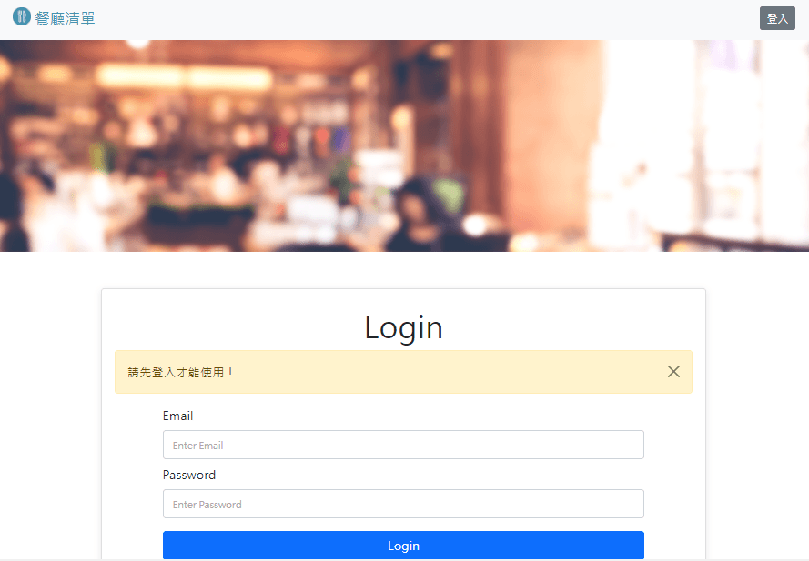

# Restaurant List with CRUD function

<br>
:sparkles: Record your favorite restaurant.  

## Features  
* Shows all restaurants on homepage.  
* Click image or 詳細資訊 for detailed info on restaurant.  
* You can find the specific restaurant by searching keyword(restaurant name or category).
* You also can add, edit, delete the restaurant info.

## Installation
* Install the Node.js and npm according to your OS(MacOS or Windows).
* Download the project to your local machine.
* Get into your project folder by Terminal and enter
  ```bash
  npm install
  ```

## How to use
* If you need the seeder data enter
  ```bash
  npm run seed
  ```
* Get start by enter
  ```bash
  npm run dev
  ```
  It's running when you see
  ```bash
  ==== App is running on http://localhost:3000 ====
  ==== mongodb connected! ====

  ```
* Open the browser, and enter the URL `http://localhost:3000`
* You can stop by `Ctrl + C`

## Build with
* Node.js @14.16.0
* Express.js @4.17.1
* express-handlebars @4.0.2
* mongoose @5.9.7
* Bootstrap @5.1.3
* Font-awesome @5.8.1
* body-parser @1.20.0
